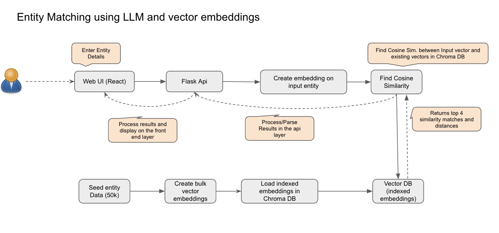

# EntityMatching

**Entity Matching using Large language models and vector database**

**Tech Stack**

[React and Javascript](https://react.dev/) : 
Popular UI front end framework 

[Material UI](https://mui.com/material-ui/) : 
Material UI is an open-source React component library that implements Google's Material Design. 

[Flask](https://flask.palletsprojects.com/en/stable/) :  
Framework to build python Apis 

[Python](https://www.python.org/downloads/): 
Backend Programming Language 
[Chroma Database (Vector DB)](https://www.trychroma.com/): 
Popular open source vector database that is designed to create, store and retrieve embeddings at scale with minimum latency. 

[Seed Data](https://www.dolthub.com/repositories/mrbond/us-businesses)  
Seed data of business entities has been downloaded from below website, 50k records have been downloaded and processed to use that data as input for the project. 


## Installation and local setup 

Install Visual Studio Code editor using this [link](https://code.visualstudio.com/) 

**Python Setup** 

Make sure python is installed in your system , if not please follow the link to install relevant python version for yous system [Python Installation](https://www.python.org/downloads) and [Visual Studio Code](https://code.visualstudio.com/) 

**Set up virtual environment and activate the virtual environment , then install openai** 
``` 
python3 -m venv .venv
source .venv/bin/activate
pip install openai
```

**Install Flask and Flask-cors** 
Flask is required to run the python back end code as an api. Flask-cors is required to set the cross origin policy in the python api

```
pip install Flask
pip install Flask-cors
```

**Install pandas**

```
pip install pandas
```

**Chroma DB** 
Follow the instructions from [ChromaDB website](https://www.trychroma.com/) to install chroma db in local system.
You can run the following commands to install the chroma DB and run it in the local system

```
pip install chromadb 
chroma run
```

**Optional** Create an openAI API key by signing up in (https://openai.com/) , embeddings can also be created using default Embedding functions provided by chroma db.
Chroma database also supports embeddings creating by partners like Open AI , If you wish to create embeddings using openAI, make sure to create an Open AI key and include that in the .env file.

**Install node and react using following instructions**

Download Node using the prebuilt installer from the [Node website](https://nodejs.org/en/download/prebuilt-installer)

Install Material UI using following commands

```
npm install @mui/material @emotion/react @emotion/styled - install material ui
npm install @mui/x-data-grid

```

**Start the Flask Api server** Run the folliwng file to start the FLask Api server in local.

```
python3 matchApiHome.py
```
The above command if successful, should start the flask server in the local instance.


**Now we are ready to start the Front end**
Follow the prompts of the below command to provide the project name and select react/ javascript project from the options

```
npm create vite@latest

```

The project name used here is "frontend" , Once this project folder is created , run the following commends from inside the "frontend" folder.

```
npm install
npm run dev

```
The above command will start running the local version of the User Interface.
**Load the seed data into the chroma db database**

Run the following command

```
python3 runSeedDataFile.py 
```

Once the seed data is loaded into the chroma database , terminal should show a success message "the seed data embeddings successfully created in chroma database". A db folder should be created inside the home directory which should have the sqllite database and correspinsind tables inside it. The chromadb database can be explored more by installing a sqllite explorer client using visual studio code if you are interested in looking at how the collections and data is stored inside the chroma db database.

Running the embedding functions : The Entity name and address columns have been combined to create a document string which will is used to generate the embeddings. The embeddings can be created using default embedding function provided by Chroma db or by using embedding functions provide by partner platforms like OpenAI, Huggingface etc. If you wish to use OpenAI for embeddings , then create an openAI key and put that key into the .env file. A template of .env is provided in the github codebase.

The view explains the high level Entity Matching High level flow:



Once the UI is running , you can also use random test entities or entities from the seed dataset file "us-businesses_master_50k_processed.csv" from this github repo. The UI should perform embedding based search of the input entity name and address and return top 3 results based on the similarity distances between matching entities in the existing entities in the database and the input entity.


